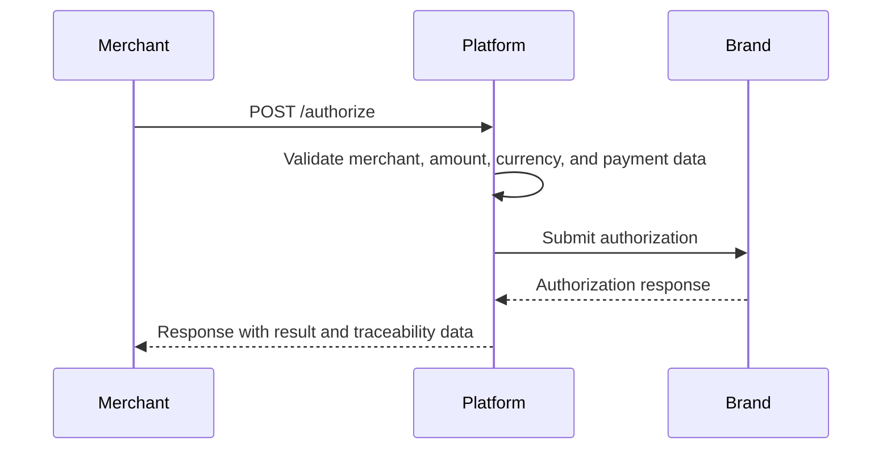
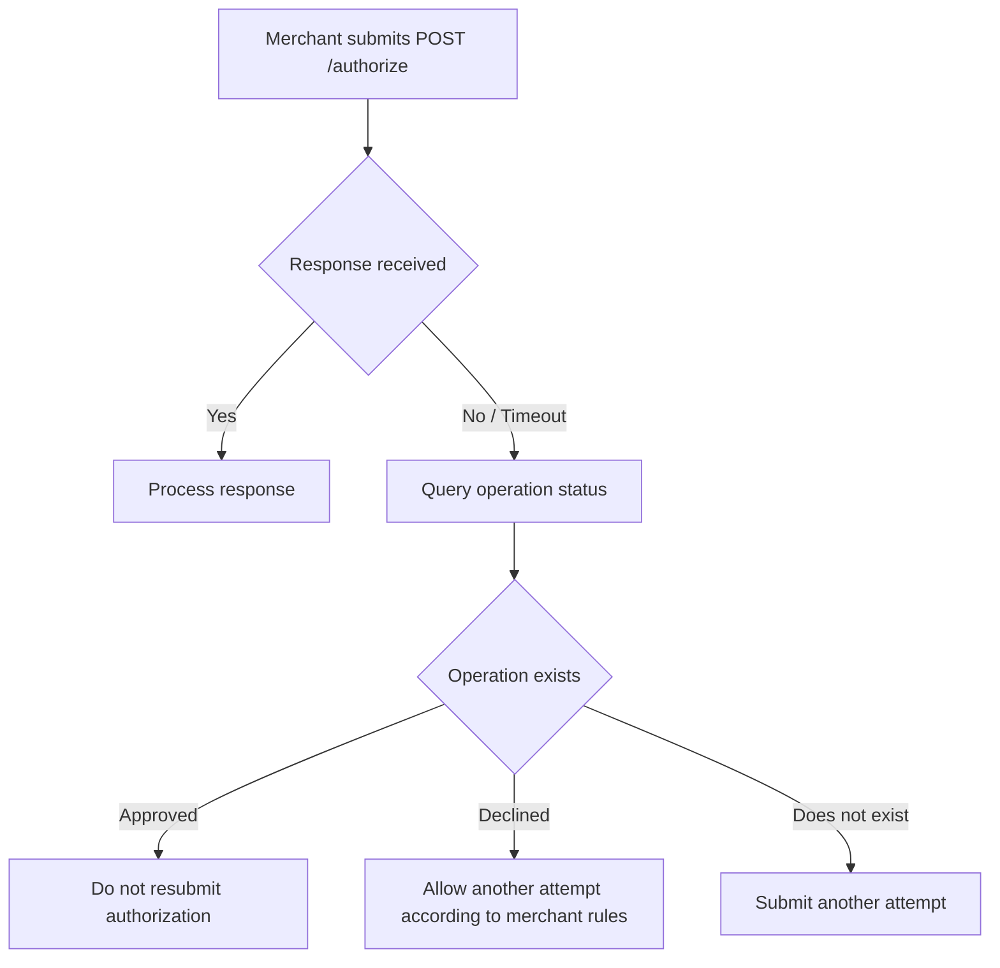

This page summarizes the main technical and operational recommendations for correctly integrating the authorization service through `POST /authorize`.

It applies to these channels:

* Ecommerce
* POS

## Endpoint

```http
POST /authorize
```

## Scope

The authorization service processes payment transactions submitted by a merchant, terminal, PinPad, checkout, or server-to-server integration.

An authorization may originate from different channels according to `frame_type`.

| Channel   | `frame_type` value | Description                                                                                                 |
| --------- | ------------------ | ----------------------------------------------------------------------------------------------------------- |
| Ecommerce | `ecommerce`        | Card-not-present transaction from a web checkout, mobile checkout, payment link, or server integration.     |
| POS       | `pos`              | In-person transaction from a POS terminal, PinPad, Android POS, or physical card capture.                   |

## General authorization flow



## Flow steps

| Step | Description                                                                                  |
| ---- | -------------------------------------------------------------------------------------------- |
| 1    | The merchant creates a purchase order or payment operation.                                  |
| 2    | The merchant captures or obtains payment data according to the channel.                      |
| 3    | The merchant builds the authorization message.                                               |
| 4    | The merchant calls `POST /authorize`.                                                        |
| 5    | The platform validates the structure, merchant, currency, amount, and submitted data.        |
| 6    | The platform processes the transaction with the corresponding card brand.                    |
| 7    | The platform returns the authorization response.                                             |
| 8    | The merchant stores the traceability identifiers.                                            |

## Supported channels

| Channel   | Recommended use                                                                                  |
| --------- | ------------------------------------------------------------------------------------------------ |
| Ecommerce | Web checkout, mobile checkout, payment-link, or direct backend payments.                          |
| POS       | In-person payments using chip, contactless, magnetic stripe, or manual card entry.                |

## Supported brands

| Value  | Brand      |
| ------ | ---------- |
| `visa` | Visa       |
| `mscd` | Mastercard |

## Supported currencies

Submit currency fields as numeric ISO 4217 codes.

| Currency | Numeric ISO 4217 code |
| -------- | --------------------- |
| PEN      | `604`                 |
| USD      | `840`                 |

## Amount format

Submit all amounts as strings without a decimal separator or thousands separators.

Calculate the amount using the currency exponent.

```text
Submitted amount = actual amount × 10^currency exponent
```

Example for PEN:

| Actual amount | Currency code | Submitted value |
| ------------: | ------------- | --------------: |
|         10.00 | `604`         |          `1000` |
|        389.80 | `604`         |         `38980` |
|      1,250.50 | `604`         |        `125050` |
|     50,000.00 | `604`         |       `5000000` |

## Incorrect amount examples

| Submitted value | Reason                                                        |
| --------------- | ------------------------------------------------------------- |
| `389.80`        | Do not include a decimal separator.                           |
| `1,250.50`      | Do not include thousands or decimal separators.               |
| `S/ 389.80`     | Do not include a currency symbol.                             |
| `38980.00`      | Do not include decimals.                                      |

## Correct amount examples

| Actual amount | Correct value |
| ------------: | ------------: |
|          1.00 |         `100` |
|         10.50 |        `1050` |
|        389.80 |       `38980` |
|      1,250.50 |      `125050` |

## Operation identifier

`internal_operation_number` identifies the merchant operation.

It must be unique per merchant and retained for queries, traceability, support, and reconciliation.

| Field                                        | Description                                          |
| -------------------------------------------- | ---------------------------------------------------- |
| `internal_operation_number`                  | Merchant-generated reference or order number.        |
| `transaction.meta.internal_operation_number` | Operation reference submitted in POS messages.       |

## Rules for `internal_operation_number`

| Rule          | Description                                                                    |
| ------------- | ------------------------------------------------------------------------------ |
| Uniqueness    | It must be unique per merchant.                                                |
| Length        | It must meet the length defined in the applicable channel guide.               |
| Traceability  | It must map to the merchant's order or sale.                                   |
| Reuse         | Do not reuse it for a new purchase.                                            |

## Idempotency and duplicates

Use `internal_operation_number` to control duplicate operations.

Do not reuse the same operation identifier for multiple authorizations because doing so may cause duplicate declines or reconciliation inconsistencies.

| Scenario              | Recommendation                                                                         |
| --------------------- | -------------------------------------------------------------------------------------- |
| New purchase          | Generate a new `internal_operation_number`.                                            |
| Retry after timeout   | Query the operation status before submitting a new authorization.                      |
| Validation error      | Correct and resubmit the message only if the operation was not processed.              |
| Approved operation    | Do not resubmit the same operation.                                                     |
| Declined operation    | Allow a new attempt according to the merchant's rules.                                 |

## Sensitive data

Encrypt sensitive card data before calling the authorization service.

| Field                                        | Channel   | Encryption required |
| -------------------------------------------- | --------- | ------------------- |
| `card.pan`                                   | Ecommerce | Yes                 |
| `card.expiry_date`                           | Ecommerce | Yes                 |
| `card.security_code`                         | Ecommerce | Yes                 |
| `payment_method.card[].pan`                  | POS       | Yes                 |
| `payment_method.card[].expiry_date`          | POS       | Yes                 |
| `payment_method.card[].card_sequence_number` | POS       | Yes, when applicable|

## Information prohibited in free-form fields

Do not submit sensitive information in free-form fields such as `metadata` or `additional_fields`.

| Information type             | Allowed in metadata |
| ---------------------------- | ------------------- |
| Card number                  | No                  |
| CVV or security code         | No                  |
| Expiration date              | No                  |
| PIN or PIN block             | No                  |
| Sensitive identity document  | No                  |
| Order number                 | Yes                 |
| Branch code                  | Yes                 |
| Sales channel                | Yes                 |
| Shopping-cart identifier     | Yes                 |
| Seller code                  | Yes                 |

## Recommended use of `metadata`

Use `metadata` to submit additional merchant information for traceability, reporting, or reconciliation.

```json
{
  "metadata": {
    "branch": "Branch 1",
    "channel": "web",
    "order_number": "ORD-123456",
    "seller_code": "SELLER-001"
  }
}
```

| Suggested field      | Use                                                       |
| -------------------- | --------------------------------------------------------- |
| `branch`             | Identify the store, agency, or point of sale.             |
| `channel`            | Identify the operation's source channel.                  |
| `order_number`       | Map the transaction to the merchant order.                |
| `seller_code`        | Identify the associated seller or advisor.                |
| `cart_identifier`    | Map the operation to a shopping cart.                     |

## Recommended use of `additional_fields`

For POS, use `transaction.meta.additional_fields` to submit supplemental operation information.

```json
{
  "transaction": {
    "currency": "604",
    "amount": "5000000",
    "meta": {
      "internal_operation_number": "123554",
      "additional_fields": {
        "branch": "Branch 1",
        "terminal_logical_id": "TERM-001"
      }
    }
  }
}
```

## Timeouts and retries

If the merchant receives no response because of a timeout or communication error, do not automatically assume that the operation was declined.

Query the operation status before submitting another authorization.

| Case                      | Recommended action                                      |
| ------------------------- | ------------------------------------------------------- |
| Timeout with no response  | Query status before retrying.                           |
| HTTP error                | Confirm whether the operation was registered.           |
| Approved response         | Do not resubmit the same operation.                     |
| Declined response         | Allow another attempt according to merchant rules.      |
| No operation record       | Generate another attempt according to merchant policy.  |

## Recommended timeout flow



***

## Recommended fields to store

The merchant should store the response identifiers required for queries, reversals, support, reconciliation, and traceability.

| Field                                   | Recommended use                                |
| --------------------------------------- | ---------------------------------------------- |
| `tk_transaction_identifier`             | Unique internal transaction identifier.        |
| `authorization_identification_response` | Operation authorization code.                  |
| `retrieval_reference_code`              | Traceability, support, and reconciliation.      |
| `system_trace_audit`                    | STAN identifier for operational tracking.       |
| `brand_transaction_identifier`          | Identifier assigned by the card brand.          |
| `response_code`                         | Validate the operation result.                  |
| `date_settlement`                       | Estimated settlement date.                     |
| `internal_operation_number`             | Link to the merchant order.                     |

***

## Operational use of identifiers

| Identifier                              | Use                                              |
| --------------------------------------- | ------------------------------------------------ |
| `tk_transaction_identifier`             | Internal platform queries.                       |
| `brand_transaction_identifier`          | Validation with the card brand.                  |
| `authorization_identification_response` | Confirmation of an approved authorization.       |
| `retrieval_reference_code`              | Reconciliation, support, and operational tracking.|
| `system_trace_audit`                    | Transaction auditing and tracking.               |
| `date_settlement`                       | Settlement estimate.                             |

***

## General response interpretation

For an approved authorization, validate both the card-brand response and the platform's internal status.

| Field                              | Expected value      | Interpretation                       |
| ---------------------------------- | ------------------- | ------------------------------------ |
| `success`                          | `true`              | The service processed the request.   |
| `processor_response.message.code`  | `00`                | The card brand returned an approval. |
| `processor_response.response_code` | `00`                | ISO approval code.                   |
| `meta.status.code`                 | `success_operation` | Successful internal status.          |

## Reference internal statuses

These statuses are provided for reference and may vary with service configuration.

| Status                 | Description                                                             |
| ---------------------- | ----------------------------------------------------------------------- |
| `success_operation`    | The operation was processed successfully.                               |
| `invalid_request`      | The request contains invalid or incomplete fields.                      |
| `merchant_not_found`   | The merchant was not found.                                              |
| `merchant_disabled`    | The merchant is not enabled to operate.                                  |
| `duplicated_operation` | The operation reference has already been used.                          |
| `processor_error`      | An error occurred while processing with the brand or processor.         |
| `timeout`              | No response was received within the expected time.                      |

## Common errors

| Scenario             | Likely cause                                                | Recommended action                                                                  |
| -------------------- | ----------------------------------------------------------- | ----------------------------------------------------------------------------------- |
| Incorrect amount     | Amount included decimals or separators.                     | Send it without a decimal separator. Example: `389.80` becomes `38980`.            |
| Merchant not enabled | `merchant_identifier` does not exist or is inactive.        | Validate the merchant during onboarding.                                            |
| Invalid brand        | A value other than `visa` or `mscd` was submitted.          | Validate `brand`.                                                                   |
| Duplicate operation  | `internal_operation_number` was already used.               | Generate a new unique reference or query the original operation.                    |
| Invalid card data    | Sensitive fields were not encrypted correctly.             | Verify encryption before submitting the authorization.                             |
| Incomplete EMV data  | A chip/contactless POS operation omitted `icc_related_data`.| Include the required EMV fields.                                                    |
| Invalid currency     | Unsupported or incorrectly formatted currency.             | Submit a numeric ISO 4217 code.                                                     |
| Unknown terminal     | `terminal_id` does not exist or is not enabled.             | Validate terminal registration.                                                     |

## Recommended pre-validation

Before submitting an authorization, validate the following items.

| Validation                       | Ecommerce           | POS                         |
| -------------------------------- | ------------------- | --------------------------- |
| Active merchant                  | Yes                 | Yes                         |
| Valid brand                      | Yes                 | Yes                         |
| Amount without decimals          | Yes                 | Yes                         |
| Numeric ISO 4217 currency        | Yes                 | Yes                         |
| Unique operation identifier      | Yes                 | Yes                         |
| Encrypted sensitive data         | Yes                 | Yes                         |
| Enabled terminal                 | Not applicable      | Yes                         |
| Correct capture mode             | Not applicable      | Yes                         |
| Complete EMV data                | Not applicable      | Yes for chip/contactless    |
| Valid 3DS data                   | Yes, when applicable| Not applicable              |

## Ecommerce recommendations

| Recommendation          | Description                                                                          |
| ----------------------- | ------------------------------------------------------------------------------------ |
| Submit cardholder email | Use `card_holder.email_address` when available for traceability and support.         |
| Submit 3DS data         | Include `authentication.3d_secure` after authentication.                             |
| Use metadata            | Record branch, channel, order number, or cart identifier.                            |
| Keep a unique reference | Map `internal_operation_number` to the merchant order.                               |
| Exclude sensitive data  | Do not include PAN, CVV, or encrypted data in `metadata`.                            |

## POS recommendations

| Recommendation        | Description                                                                                                  |
| --------------------- | ------------------------------------------------------------------------------------------------------------ |
| Validate capture mode | `pan_entry_mode` must reflect the actual card-capture method.                                                |
| Submit EMV data       | Include `icc_related_data` for chip or contactless EMV operations.                                          |
| Validate terminal     | `terminal_id` must correspond to a registered, enabled terminal.                                            |
| Submit PIN if needed  | Include `pin_block` when the operation requires a PIN.                                                      |
| Do not mix contexts   | Do not submit EMV data for manual or magnetic-stripe capture unless required by terminal configuration.     |

***

## POS rules by capture type

| Capture type    | `pan_entry_mode` | Requires `icc_related_data` | Requires `pin_block`                            |
| --------------- | ---------------- | --------------------------- | ------------------------------------------------|
| Manual          | `01`             | No                          | No, unless required by merchant or issuer rules |
| Chip            | `05`             | Yes                         | Yes, when applicable                            |
| Contactless EMV | `07`             | Yes                         | According to amount, merchant, or issuer rules  |
| Magnetic stripe | `90`             | No                          | Yes, when applicable                            |

## Integration best practices

| Best practice                 | Description                                                                 |
| ----------------------------- | --------------------------------------------------------------------------- |
| Validate required fields      | The merchant should validate the message before submission.                 |
| Do not store sensitive data   | Do not store PAN, CVV, expiration date, or PIN.                             |
| Log request and response      | Log useful support data while excluding sensitive information.              |
| Store identifiers             | Store the traceability identifiers returned in the response.                |
| Handle timeouts               | Query the operation before retrying an authorization.                       |
| Prevent duplicates            | Do not duplicate authorizations after communication errors.                 |
| Use metadata correctly        | Submit only non-sensitive operational or commercial information.            |
| Separate flows                | Distinguish Ecommerce and POS through `frame_type`.                          |
| Validate amounts              | Submit amounts without decimals and with the correct currency.               |
| Validate terminals            | For POS, confirm the terminal is registered and enabled.                     |

## Ecommerce integration checklist

| Item                        | Validation                                                       |
| --------------------------- | ---------------------------------------------------------------- |
| `frame_type`                | Must be `ecommerce`.                                             |
| `merchant_identifier`       | Must correspond to an active merchant.                           |
| `brand`                     | Must be `visa` or `mscd`.                                        |
| `internal_operation_number` | Must be unique per merchant.                                     |
| `amount`                    | Must be submitted without decimals.                              |
| `currency`                  | Must use numeric ISO 4217 format.                                |
| `card.pan`                  | Must be encrypted.                                               |
| `card.expiry_date`          | Must be encrypted.                                               |
| `card.security_code`        | Must be encrypted when applicable.                               |
| `installments`              | Include only for installment payments.                           |
| `authentication.3d_secure`  | Include only when the transaction has 3DS data.                  |
| `metadata`                  | Must not contain sensitive data.                                 |

## POS integration checklist

| Item                                         | Validation                                                 |
| -------------------------------------------- | ---------------------------------------------------------- |
| `frame_type`                                 | Must be `pos`.                                             |
| `merchant_identifier`                        | Must correspond to an active merchant.                     |
| `brand`                                      | Must be `visa` or `mscd`.                                  |
| `payment_method.card[].pan`                  | Must be encrypted.                                         |
| `payment_method.card[].expiry_date`          | Must be encrypted.                                         |
| `payment_method.terminal.terminal_id`        | Must correspond to a registered terminal.                  |
| `context.pos.pan_entry_mode`                 | Must reflect the actual capture method.                     |
| `context.pos.pin_entry_capability`           | Must reflect the terminal's actual capability.             |
| `transaction.amount`                         | Must be submitted without decimals.                        |
| `transaction.currency`                       | Must use numeric ISO 4217 format.                           |
| `transaction.meta.internal_operation_number` | Must be unique per merchant.                               |
| `icc_related_data`                           | Required for chip or contactless EMV operations.           |

## Reconciliation recommendations

To simplify reconciliation, retain the relationship between the merchant's internal order and the identifiers returned by the platform.

| Merchant data             | Platform or card-brand data               |
| ------------------------- | ----------------------------------------- |
| Order number              | `internal_operation_number`               |
| Internal transaction ID   | `tk_transaction_identifier`               |
| Authorization code        | `authorization_identification_response`   |
| RRN                       | `retrieval_reference_code`                |
| STAN                      | `system_trace_audit`                      |
| Card-brand ID             | `brand_transaction_identifier`            |
| Estimated settlement date | `date_settlement`                         |

## Support recommendations

Include the following information when reporting an incident.

| Data                                    | Description                            |
| --------------------------------------- | -------------------------------------- |
| `merchant_identifier`                   | Merchant identifier.                   |
| `internal_operation_number`             | Merchant order or operation number.    |
| `tk_transaction_identifier`             | Internal transaction identifier.       |
| `retrieval_reference_code`              | Operation RRN.                         |
| `system_trace_audit`                    | Operation STAN.                        |
| `authorization_identification_response` | Authorization code, if available.      |
| `brand`                                 | Card brand.                            |
| `amount`                                | Submitted amount.                      |
| `currency`                              | Submitted currency.                    |
| Date and time                           | Approximate transaction time.          |

***

## Authorization guides

<CardGroup>
  <Card title="Ecommerce" icon="cart-shopping" href="/en/ecommerce">
    View the Ecommerce authorization message.
  </Card>

  <Card title="POS" icon="credit-card" href="/en/pos">
    View the POS authorization message.
  </Card>

  <Card title="Response" icon="reply" href="/en/response">
    View the authorization response structure.
  </Card>
</CardGroup>
