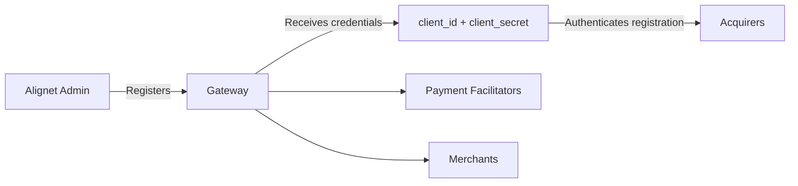

When registering an entity, the Onboarding API can generate OAuth credentials consisting of a `client_id` and `client_secret`.

## Generation by entity

| Entity | Behavior |
| --- | --- |
| Gateway | Credentials are always generated and required. |
| Acquirer | Generation is controlled with `generate_credentials: "true"` or `"false"`. |
| Payment Facilitator | Generation is controlled with `generate_credentials: "true"` or `"false"`. |
| Merchant | Generation is controlled with `generate_credentials: "true"` or `"false"`. |

<Warning>
  The `client_id` and `client_secret` are displayed only once during registration. Store them securely.
</Warning>

## Use in the registration flow

The Gateway uses its credentials to register its Acquirers. The Gateway or Acquirer can register Payment Facilitators, and the Gateway, Acquirer, or Payment Facilitator can register Merchants.

<Card title="Back to Onboarding" icon="arrow-left" href="/en/onboarding">
  Review the hierarchy, domains, and complete registration flow.
</Card>
