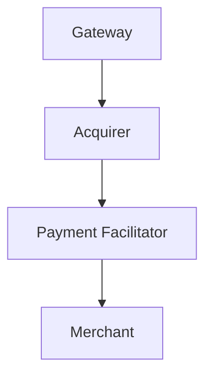
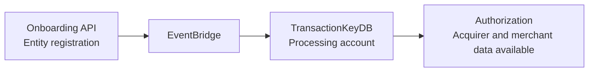

The Alignet Processing Service Onboarding API registers and manages the entities required to process Visa and Mastercard card transactions.

## Entity hierarchy

| Entity | Can create |
| --- | --- |
| Gateway | Acquirers, Payment Facilitators, and Merchants. |
| Acquirer | Payment Facilitators and Merchants. |
| Payment Facilitator | Merchants. |
| Merchant | No creation of child entities was specified. |

## API domains

| Environment | URL |
| --- | --- |
| Development | `https://api.dev.alignet.io/onboarding/*` |
| Production | `https://api.alignet.io/onboarding/*` |

## Endpoints

| Method | Path | Description | Who can invoke it |
| --- | --- | --- | --- |
| `POST` | `/onboarding/gateways` | Register a gateway. | Admin. |
| `GET` | `/onboarding/gateways/{code}` | Retrieve a gateway. | Admin, the Gateway itself. |
| `PUT` | `/onboarding/gateways/{code}` | Update a gateway. | Admin. |
| `POST` | `/onboarding/acquirers` | Register an acquirer. | Admin, Gateway. |
| `GET` | `/onboarding/acquirers/{code}` | Retrieve an acquirer. | Admin, Gateway, Acquirer. |
| `PUT` | `/onboarding/acquirers/{code}` | Update an acquirer. | Admin, Gateway. |
| `POST` | `/onboarding/pfs` | Register a payment facilitator. | Admin, Gateway, Acquirer. |
| `GET` | `/onboarding/pfs/{code}` | Retrieve a PF. | Admin, Gateway, Acquirer, PF. |
| `PUT` | `/onboarding/pfs/{code}` | Update a PF. | Admin, Gateway, Acquirer. |
| `POST` | `/onboarding/merchants` | Register a merchant. | Admin, Gateway, Acquirer, PF. |
| `GET` | `/onboarding/merchants/{code}` | Retrieve a merchant. | Admin, Gateway, Acquirer, PF. |
| `PUT` | `/onboarding/merchants/{code}` | Update a merchant. | Admin, Gateway, Acquirer, PF. |

## Credentials

When registering an entity, the API can generate OAuth credentials (`client_id` and `client_secret`) through the `generate_credentials` flag.

| Entity | Credential generation |
| --- | --- |
| Gateway | Always generated and required. |
| Acquirer | Configurable with `generate_credentials: "true"` or `"false"`. |
| Payment Facilitator | Configurable with `generate_credentials: "true"` or `"false"`. |
| Merchant | Configurable with `generate_credentials: "true"` or `"false"`. |

<Warning>
  Credentials are displayed only once during registration. Store them securely.
</Warning>

## Registration flow

<Steps>
  <Step title="Register the Gateway">
    The Alignet Admin registers the Gateway. The Gateway receives its credentials.
  </Step>
  <Step title="Register the Acquirers">
    The Gateway uses its credentials to register its Acquirers.
  </Step>
  <Step title="Register the Payment Facilitators">
    The Gateway or Acquirer registers the Payment Facilitators, if applicable.
  </Step>
  <Step title="Register the Merchants">
    The Gateway, Acquirer, or Payment Facilitator registers the Merchants.
  </Step>
</Steps>

## TransactionKeyDB synchronization

When each entity is registered through the Onboarding API, its regulatory data is automatically synchronized with TransactionKeyDB, the processing account, through EventBridge.

This synchronization makes the acquirer information, including BINs and institution codes, and merchant information available to the authorization flow without manual intervention.

## Onboarding guides

<CardGroup cols={2}>
  <Card title="Authentication and security" icon="shield-halved" href="/en/onboarding/authentication-security">
    Review OAuth credential generation and secure storage.
  </Card>
  <Card title="Gateway registration" icon="server" href="/en/onboarding/gateway">
    Review the operations available for Gateways.
  </Card>
  <Card title="Acquirer registration" icon="building-columns" href="/en/onboarding/acquirer">
    Review the operations available for Acquirers.
  </Card>
  <Card title="Payment Facilitator registration" icon="network-wired" href="/en/onboarding/payment-facilitator">
    Review the operations available for Payment Facilitators.
  </Card>
  <Card title="Merchant registration" icon="store" href="/en/onboarding/merchant">
    Review the operations available for Merchants.
  </Card>
  <Card title="Ecommerce authorization" icon="cart-shopping" href="/en/onboarding/ecommerce-authorization-flow">
    Review how Onboarding data becomes available to Ecommerce.
  </Card>
  <Card title="POS authorization" icon="credit-card" href="/en/onboarding/pos-authorization-flow">
    Review how Onboarding data becomes available to POS.
  </Card>
</CardGroup>
