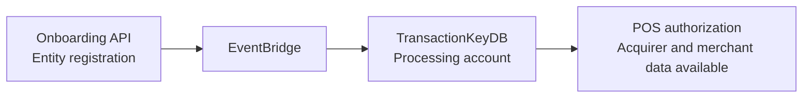

When each entity is registered through the Onboarding API, its regulatory data is automatically synchronized with TransactionKeyDB through EventBridge.

The synchronization makes the acquirer information, including BINs and institution codes, and merchant information available to POS authorization without manual intervention.

<Card title="View POS authorization" icon="credit-card" href="/en/pos">
  Review the `POST /authorize` endpoint documentation for POS.
</Card>
