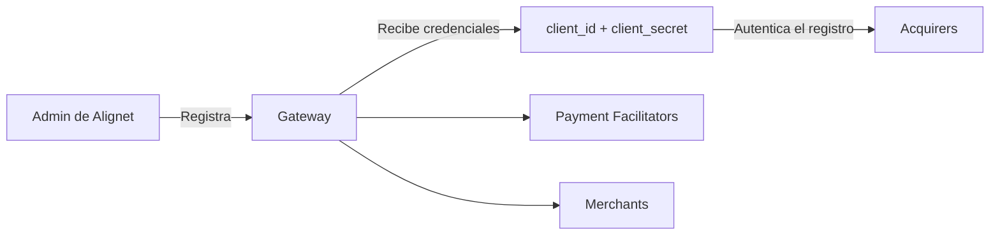

Al registrar una entidad, el API de Onboarding puede generar credenciales OAuth compuestas por `client_id` y `client_secret`.

## Generación por entidad

| Entidad | Comportamiento |
| --- | --- |
| Gateway | Las credenciales siempre se generan y son obligatorias. |
| Acquirer | La generación se controla mediante `generate_credentials: "true"` o `"false"`. |
| Payment Facilitator | La generación se controla mediante `generate_credentials: "true"` o `"false"`. |
| Merchant | La generación se controla mediante `generate_credentials: "true"` o `"false"`. |

<Warning>
  El `client_id` y el `client_secret` se muestran una sola vez durante el registro. Deben almacenarse de forma segura.
</Warning>

## Uso en el flujo de registro

El Gateway utiliza sus credenciales para registrar sus Acquirers. El Gateway o el Acquirer puede registrar Payment Facilitators, y el Gateway, Acquirer o Payment Facilitator puede registrar Merchants.

<Card title="Volver a Onboarding" icon="arrow-left" href="/onboarding">
  Consulta la jerarquía, los dominios y el flujo completo de registro.
</Card>
