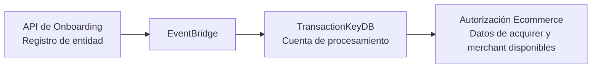

Al registrar cada entidad en el API de Onboarding, los datos normativos se sincronizan automáticamente con TransactionKeyDB mediante EventBridge.

La sincronización permite que la autorización Ecommerce disponga de la información del acquirer, incluidos los BINs y códigos de institución, y del merchant sin intervención manual.

<Card title="Ver autorización Ecommerce" icon="cart-shopping" href="/ecommerce">
  Consulta la documentación del endpoint `POST /authorize` para Ecommerce.
</Card>
