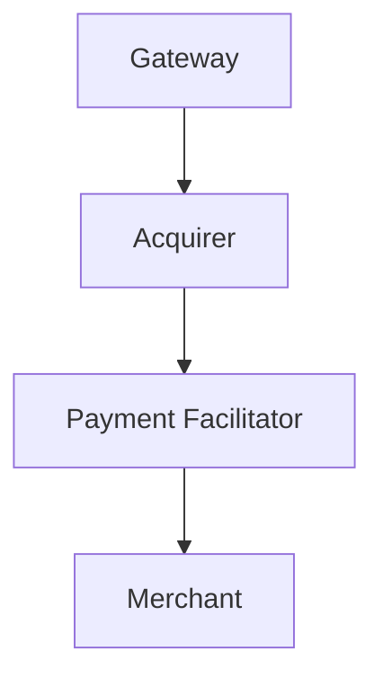
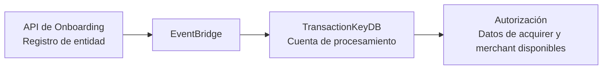

El API de Onboarding del Servicio de Procesamiento de Alignet permite registrar y administrar las entidades necesarias para procesar transacciones con tarjetas Visa y Mastercard.

## Jerarquía de entidades

| Entidad | Puede crear |
| --- | --- |
| Gateway | Acquirers, Payment Facilitators y Merchants. |
| Acquirer | Payment Facilitators y Merchants. |
| Payment Facilitator | Merchants. |
| Merchant | No se indicó creación de entidades hijas. |

## Dominios del API

| Ambiente | URL |
| --- | --- |
| Desarrollo | `https://api.dev.alignet.io/onboarding/*` |
| Producción | `https://api.alignet.io/onboarding/*` |

## Endpoints

| Método | Path | Descripción | Quién puede invocar |
| --- | --- | --- | --- |
| `POST` | `/onboarding/gateways` | Registrar un gateway. | Admin. |
| `GET` | `/onboarding/gateways/{code}` | Consultar un gateway. | Admin, Gateway propio. |
| `PUT` | `/onboarding/gateways/{code}` | Actualizar un gateway. | Admin. |
| `POST` | `/onboarding/acquirers` | Registrar un acquirer. | Admin, Gateway. |
| `GET` | `/onboarding/acquirers/{code}` | Consultar un acquirer. | Admin, Gateway, Acquirer. |
| `PUT` | `/onboarding/acquirers/{code}` | Actualizar un acquirer. | Admin, Gateway. |
| `POST` | `/onboarding/pfs` | Registrar un payment facilitator. | Admin, Gateway, Acquirer. |
| `GET` | `/onboarding/pfs/{code}` | Consultar un PF. | Admin, Gateway, Acquirer, PF. |
| `PUT` | `/onboarding/pfs/{code}` | Actualizar un PF. | Admin, Gateway, Acquirer. |
| `POST` | `/onboarding/merchants` | Registrar un merchant. | Admin, Gateway, Acquirer, PF. |
| `GET` | `/onboarding/merchants/{code}` | Consultar un merchant. | Admin, Gateway, Acquirer, PF. |
| `PUT` | `/onboarding/merchants/{code}` | Actualizar un merchant. | Admin, Gateway, Acquirer, PF. |

## Credenciales

Al registrar una entidad, se pueden generar credenciales OAuth (`client_id` y `client_secret`) mediante el flag `generate_credentials`.

| Entidad | Generación de credenciales |
| --- | --- |
| Gateway | Siempre se generan; es obligatorio. |
| Acquirer | Configurable mediante `generate_credentials: "true"` o `"false"`. |
| Payment Facilitator | Configurable mediante `generate_credentials: "true"` o `"false"`. |
| Merchant | Configurable mediante `generate_credentials: "true"` o `"false"`. |

<Warning>
  Las credenciales se muestran una sola vez al momento del registro. Deben almacenarse de forma segura.
</Warning>

## Flujo de registro

<Steps>
  <Step title="Registrar el Gateway">
    El Admin de Alignet registra el Gateway. El Gateway recibe sus credenciales.
  </Step>
  <Step title="Registrar los Acquirers">
    El Gateway utiliza sus credenciales para registrar sus Acquirers.
  </Step>
  <Step title="Registrar los Payment Facilitators">
    El Gateway o el Acquirer registra los Payment Facilitators, si aplica.
  </Step>
  <Step title="Registrar los Merchants">
    El Gateway, el Acquirer o el Payment Facilitator registra los Merchants.
  </Step>
</Steps>

## Sincronización con TransactionKeyDB

Al registrar cada entidad en el API de Onboarding, los datos normativos se sincronizan automáticamente con TransactionKeyDB, la cuenta de procesamiento, mediante EventBridge.

Esta sincronización permite que el flujo de autorización disponga de la información del acquirer, incluidos los BINs y códigos de institución, y del merchant sin intervención manual.

## Guías de Onboarding

<CardGroup cols={2}>
  <Card title="Autenticación y seguridad" icon="shield-halved" href="/onboarding/authentication-security">
    Revisa la generación y custodia de credenciales OAuth.
  </Card>
  <Card title="Registro de Gateway" icon="server" href="/onboarding/gateway">
    Consulta las operaciones disponibles para Gateways.
  </Card>
  <Card title="Registro de Acquirer" icon="building-columns" href="/onboarding/acquirer">
    Consulta las operaciones disponibles para Acquirers.
  </Card>
  <Card title="Registro de Payment Facilitator" icon="network-wired" href="/onboarding/payment-facilitator">
    Consulta las operaciones disponibles para Payment Facilitators.
  </Card>
  <Card title="Registro de Merchant" icon="store" href="/onboarding/merchant">
    Consulta las operaciones disponibles para Merchants.
  </Card>
  <Card title="Autorización Ecommerce" icon="cart-shopping" href="/onboarding/ecommerce-authorization-flow">
    Revisa la disponibilidad de los datos de Onboarding para Ecommerce.
  </Card>
  <Card title="Autorización POS" icon="credit-card" href="/onboarding/pos-authorization-flow">
    Revisa la disponibilidad de los datos de Onboarding para POS.
  </Card>
</CardGroup>
